## Deploying and Starting a Workflow


Lesson 1: Deploying and Starting a Workflow

Note:

This first lesson describes why you might want to use workflows as part of your ForgeRock&reg; Identity Management (IDM) solution, explains how IDM includes the Activiti workflow engine, and then shows how to deploy workflows within IDM and manage those workflows from the IDM Admin UI.

---

#### Lesson objectives

Upon completion of this lesson, you should be able to:

- Describe use cases for workflows
- Describe how workflows are implemented in IDM
- Enable the workflow service in IDM and examine a sample workflow

Note:

The slide lists the objectives for this lesson.

---

### Describe use cases for workflows

Upon completion of this lesson, you should be able to:

- **Describe use cases for workflows**
- Describe how workflows are implemented in IDM
- Enable the workflow service in IDM and examine a sample workflow

Note:

The first section of this lesson describes reasons for using workflow as part of your identity management solution.

---

#### General use cases

- Complex provisioning cases:
  - Setting default logic for:
    - Joiners
    - Movers
    - Leavers
  - Compliance tests during provisioning
- Need for manual interaction:
  - Approval
  - Self service requests

Note:

Some general use cases that are often used with workflows are the three life cycle stages of users in an organization:

- Joiner: A new account needs to be set for the user that includes taking care of default roles and entitlements a user needs from day one, depending on a users role in the organization.
- Movers: People who move jobs or roles within an organization for a new. People often need to be assigned new entitlements for the new role and entitlements that were needed for the old role need to be removed.
- Leavers: Accounts of users who leave the organization need to be deactivated or deleted depending on business requirements or legal reasons.

Some of the actions that need to be taken care of can be rather complex and also need manual interaction.

---

#### FEC use cases I

- Owner requests for new Family or Friends account:
  - Startup form
  - Request needs to be analyzed
  - Feedback to requester
  - Notifications to:
    - Administrators
    - New user after creation


Note:

One of the FEC requirements will be to allow a subscription owner to share the subscription with a Friend or a member of the Family.

The workflow needs to start with a form that requests the information about the new member.
The request then needs to be validated. For instance, it needs to be checked to determine whether the subscriber has already exceeded the maximum quota of shares, after which the appropriate feedback needs to be given to the requester.

Some notifications will eventually need to be sent to administrators, in case some irregularities happen, or to inform the new family or friend account owner about the creation of the account.

---

#### FEC use cases II

- Family or Friend user requests:
  - New relationship with account owner
  - New relationship with additional account owner:
    - For instance, with a premium subscription

Note:

In some other cases, it might be the family and friends user who wants to open the dialog of being connected to an owners subscription. In this case, they would already need to have an account.

Another requirement might be that the same family and friend member might need to be connected to many other subscriptions. For instance, one long term relationship with a standard subscriber, and one other, maybe more short-term one with a premium subscriber.

In this case, it would be the user without their own subscription who wants to be connected to a user with a subscription. The workflow would then need to find the correct owner and ask for the owners permission to establish the relationship.

---

#### FEC use case III

- Several long term events need to be scheduled:
  - Owner needs to be notified before trial period ends
  - Account needs to be deactivated after trial period ends
  - Housekeeping tasks for:
    - How to deactivate an account:
      - Inform user
      - Users with relationships need to be informed, too

Note:

The workflow can also be used to schedule long-term events. In this case, a workflow would be started, some logic would be executed, and then suspended for a period of time. The workflow instance would then be persisted in the repository until its time is up, and it needs to continue.
A persisted workflow instance is simply an object in the IDM repository database. It does not occupy much of the resources while it is suspended.

Examples for long term events might be:

* An owner needs to be notified before a trial period ends
* An account needs to be deactivated after a trial period ends
* Some other housekeeping tasks

---

### Describe how workflows are implemented in IDM

Upon completion of this lesson, you should be able to:

- Describe use cases for workflows
- **Describe how workflows are implemented in IDM**
- Enable the workflow service in IDM and examine a sample workflow

Note:

This section describes how workflows are implemented in IDM and how to manage workflows from the IDM Admin UI.

---

#### Activiti

- Open source process engine
- IDM uses OSGi version

Note:

The workflow engine that is used by IDM is based on Activiti. This is what the web page, www.activiti.org says:

> Activitiis the leading lightweight, java-centric open-source BPMN engine supporting real-world process automation needs.Activiti Cloudis now the new generation of business automation platform offering a set of cloud native building blocks designed to run on distributed infrastructures.

Activiti can be downloaded as web archive or an OSGi version. IDM uses the OSGi version.

---

#### IDM integration with Activiti overview

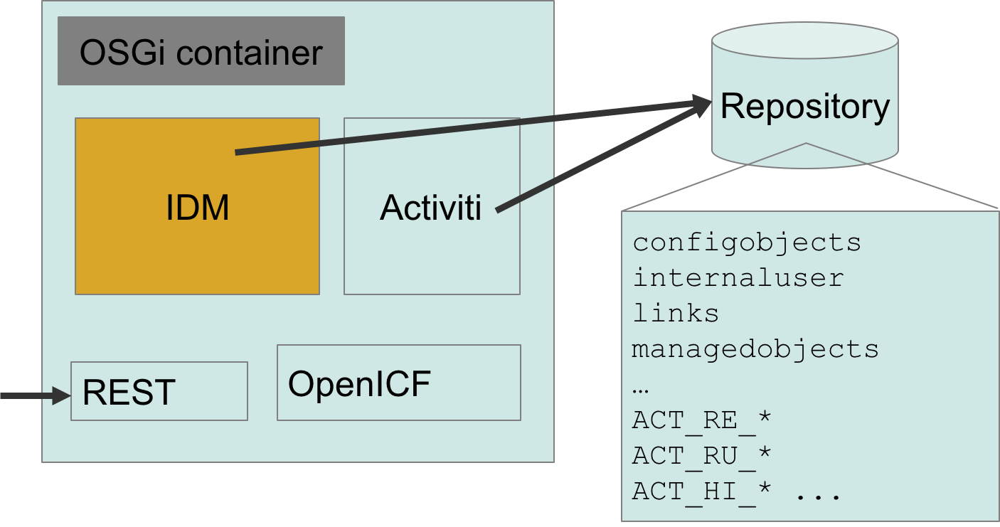

Note:

The embedded Activiti workflow and business process engine is provided as part of the standard IDM build.

Install the IDM build, as described in the *ForgeRock Identity Management Installation Guide*. Start IDM, and run the `scr list` command at the Felix console to check that the workflow bundle is active. Also, the first time you start IDM, the Activiti-related tables prefixed with `ACT_` are added to the IDM repository.

For example:

```
-> scr list
...
[ 14] [active ] org.forgerock.openidm.workflow
...
```

---

#### Workflow files: .bar files

- Contain all workflow components:
  - Process definition:
    - Scripts
    - Diagram
  - Forms
  - Java code (not automatically available in the class path!)

Note:

A `.bar` file is Activitis business archive file. These files are created by using any tool that can create a zip archive file, containing several components for a business process in file format.

A `.bar` file contains the process definition, such as the `.bmpn20.xml` file and eventually several XHTML form files.

It makes sense to package Java or `.jar` files that will eventually be needed in the archive. Please bear in mind that they will not automatically be deployed. In addition, Activiti is deployed as an OSGi service within IDM, meaning that the rules for loading Java files for OSGi containers need to be followed. For example, Java files need to be available as OSGi bundles or Felix will not load those files.

---

#### How to deploy workflows

- Deploy a new workflow
- List deployed workflows
- Make workflows available for users
- Redeploy a workflow:
  - Automatic versioning

Note:

The next few slides show how to:

* Deploy a new workflow
* List deployed workflows
* Make workflows available for users
* Redeploy a workflow

---

#### Redeploy: automatic versioning

- IDM never deletes a workflow definition
- On redeploy, a new definition with a new revision is added:
  - When a new instance is created, IDM by default starts from the last revision.
  - 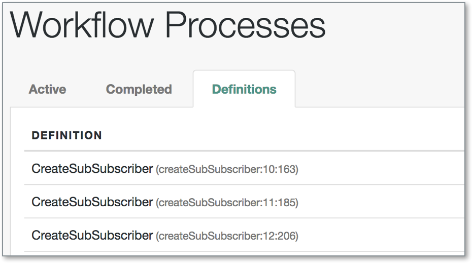
- Existing instances link to the exact revision they where started from.

Note:

Activiti will automatically provide versioning during deployment `key`, `version`, `name`, and `id`:

- The process definitions (XML) `id` is used as the (deployed) `key` attribute
- The process definitions name is used as the (deployed) `name` (attribute)
- The first time a process with a particular `key` is deployed, version `1` is assigned. For all subsequent deployments of process definitions with the same `key`, the version will be set `1` higher than the maximum currently deployed version. The `key` property is used to distinguish process definitions.
- The `id` property is set to `{processDefinitionKey}:{processDefinitionVersion}:{generated-id}`, where`generated-id`is a unique number added to guarantee uniqueness of the process id for the process definition caches in a clustered environment.

New process instances will be called by the `key` attribute. Activiti will then use the latest version to start the process and refer to it by the exact version. That way it is guaranteed that an update of the process definition will not break any existing instance.

---

#### List completed workflows

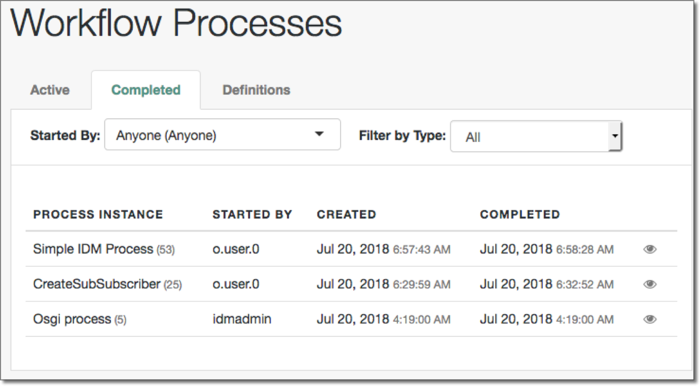

Note:

The IDM Admin UI has an interface for listing completed instances with a rudimentary filtering mechanism. The filter mechanism can be extended to the needs of customers.

Custom queries need to be implemented by using `_queryId=filtered-query` (see the *ForgeRock Identity Management Integrator's Guide* for more information).

---

#### List active workflows

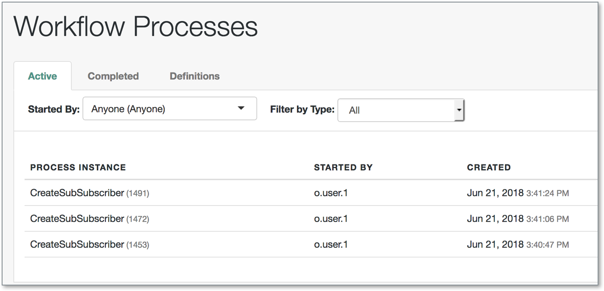

The IDM Admin UI has an interface for listing active instances with a rudimentary filtering mechanism. The filter mechanism can be extended to the needs of customers.

Custom queries need to be implemented by using `_queryId=filtered-query` (see the *ForgeRock Identity Management Integrators Guide* for more information).

---

#### Workflow definitions in IDM

- Go to Manage > Processes > Definition to view:
  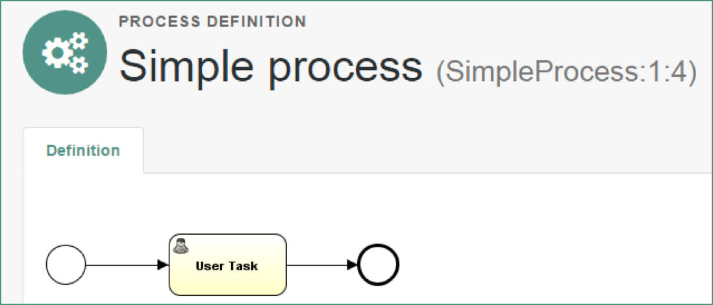
- After a workflow is deployed to the IDM `workflow` folder, the workflow is available through Admin UI and Self-Service UI

Note:

After a workflow is deployed, it appears in the IDM Admin UI.

Administrators find a list of deployed process definitions here:
Manage -> Processes -> Definition

The page will list all versions of the deployed workflow.

It can also be started by users in the Self-Service UI.

---

#### Visualize workflow definitions

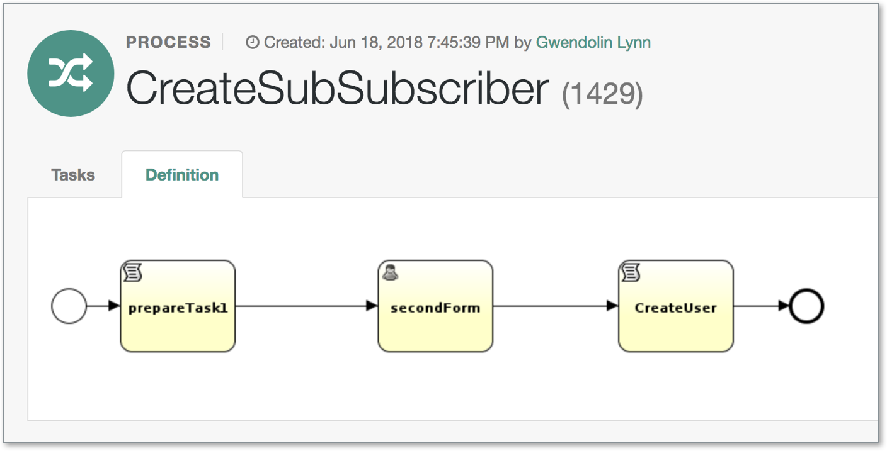

Note:

The IDM Admin UI also has an interface that can show the BPMN diagram of a deployed workflow, if the workflow definition contains the BPMN diagram part in the XML.

---

#### Visualize active workflow state

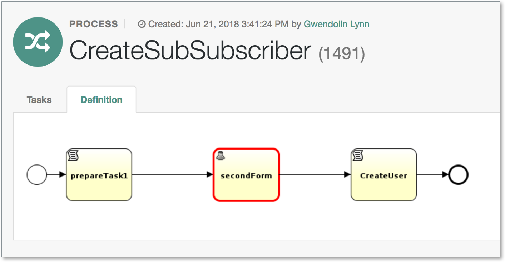

Note:

The admin UI has an interface that can show the BPMN diagram of an active workflow instance, if the workflow definition contains the BPMN diagram part in the XML.

In addition, a red frame will be drawn around the event that is currently active.

In the screen shot shown in the slide, the user task named secondForm is currently active. The workflow is probably waiting for a manual interaction with a user. For instance, it might wait for the approval of a manager.

---

#### List pending workflow tasks

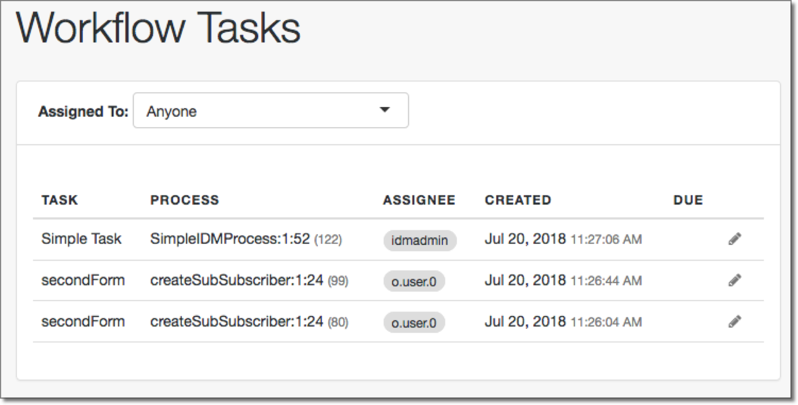

Note:

All workflow instances that are waiting for some manual interaction, like an approval of a manager, will be shown under Workflow Tasks in the Admin UI. The listing shows the user tasks that are created by the workflow, the process instance from which they have been created, and who is assigned to the task.

---

#### Asynchronous start of workflows during reconciliation

From: `./samples/sync-asynchronous/conf/sync.json`
```json
{
   "situation" : "ABSENT",
   "action" : {
      "workflowName" : "managedUserApproval",
      "type" : "text/javascript",
      "file" : "workflow/triggerWorkflowFromSync.js"
...
```

Note:

The `sync.json` file contains the situational policies for each situation. The slide illustrates the policy setting for the `ABSENT` situation. The action for the `ABSENT` situation is to run the `managedUserApproval` workflow.

The `workflow.json` file defines the actual location of the `workflow/` folder where the workflow files are stored. Also, you can set whether workflow is enabled or disabled in IDM.

The workflow location contains the `.bpmn20.xml` file (or files for multiple workflow processes) that defines the workflow process.

---

#### Visibility of Workflows in the Self-Service UI

From: `./samples/provisioning-with-workflow/conf/process-access.json
`
```json
"workflowAccess" : [
   {
       "propertiesCheck" : {
           "property" : "name",
           "matches" : "Contractor onboarding process",
           "requiresRole" : "employee"
       }
   },
   {
       "propertiesCheck" : {
           "property" : "name",
           "matches" : "Contractor onboarding process",
           "requiresRole" : "manager"
       }
   }
]
```

Note:

The UI in most cases is not supposed make all processes available for all users. Therefore, IDM has a configuration file, called `process-access.json`, which defines who can see and start a process.

`property`: The property of the workflow, which needs to match the value of the matches value (see below). Examples would be `"_id"` or `"name."`

`matches`: A regular expression, which is checked against the value of the property defined in the `property` (see above).

`requiresRole`: Specifies the role for which workflows from above should be made available.

This will currently only effect the UI, not the authorizations on the REST interface. To make it effective on the REST interface too, an authorization policy needs to be defined.

---

#### End user launching a workflow

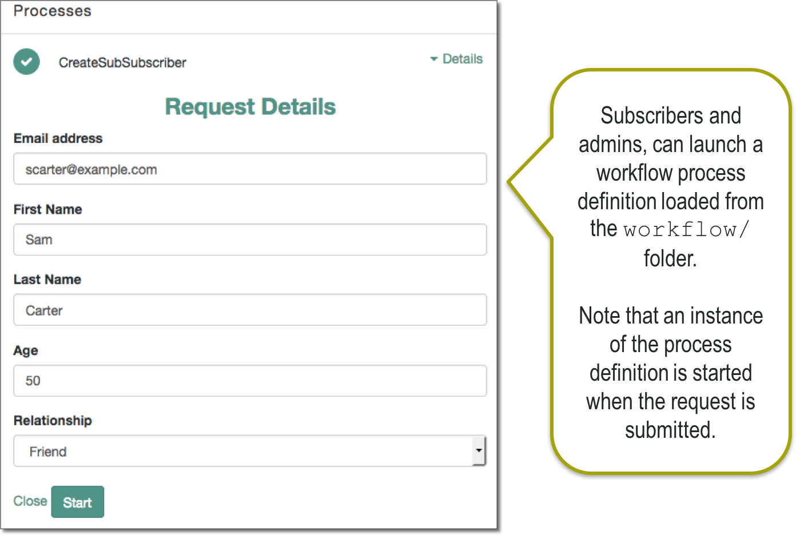

Note:

Workflow is launched by an authorized user with the correct role assignment using the Self-Service UI. The workflow process is loaded from the specified `workflow/` folder in the `conf/workflow.json` file. The workflow process shows up in the **Processes** section on the Dashboard.

Selecting the link displays the workflow definition form and allows the user to fill in the fields of the form and then start the workflow. The Start button in the form launches an instance of the workflow process definition.

---

#### End user listing pending tasks

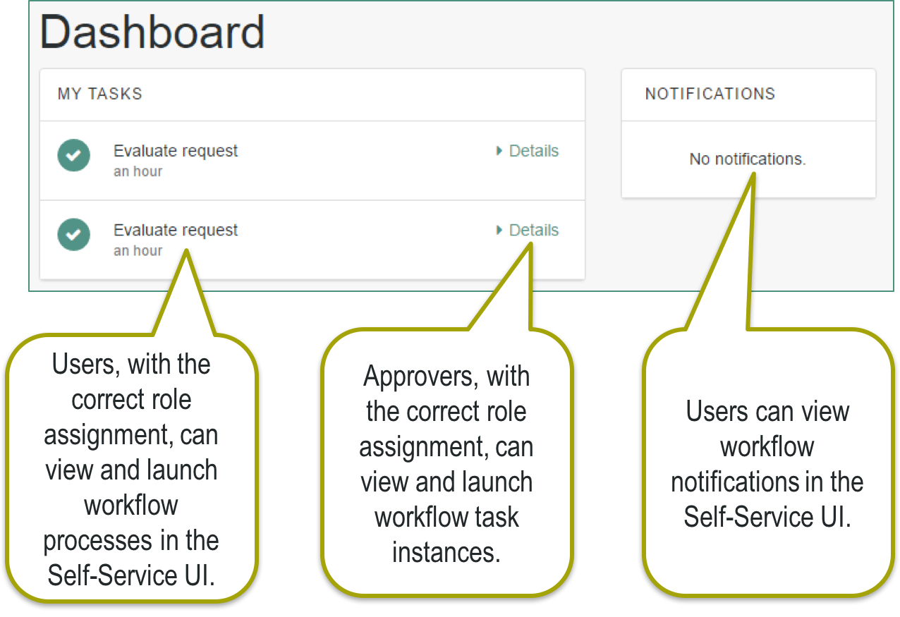

Note:

The Self-Service UI is integrated with the embedded Activiti worfklow engine, enabling users to interact with workflows. Available workflows are displayed under the **Processes** section on the Dashboard. Users with the correct role assignment can view and launch workflow processes from the Dashboard. Approvers can also view the workflow task instances from the **My tasks** section on the Dashboard. Finally, users can be notified of workflow actions in the **Notifications** section on the Dashboard.

Note that in order for a workflow to be displayed on the Dashboard, the workflow definition file (`bpmn20.xml`) must be present in the `openidm/workflow` directory. This file will be covered later in the lesson.

A sample workflow integration with the Self-Service UI is provided in `openidm/samples/workflow`, and documented in Chapter 17, "[Using a Workflow to Provision User Accounts](https://backstage.forgerock.com/docs/idm/6/samples-guide/#chap-provisioning-with-workflow)", in the *ForgeRock Identity Management Samples Guide*.

---

### Enable the workflow service in IDM and examine a sample workflow

Upon completion of this lesson, you should be able to:
- Describe use cases for workflows
- Describe how workflows are implemented in IDM
- **Enable the workflow service in IDM and examine a sample workflow**

Note:

This section introduces the lab exercise associated with this lesson.

---

#### Enable workflow in IDM from system preferences

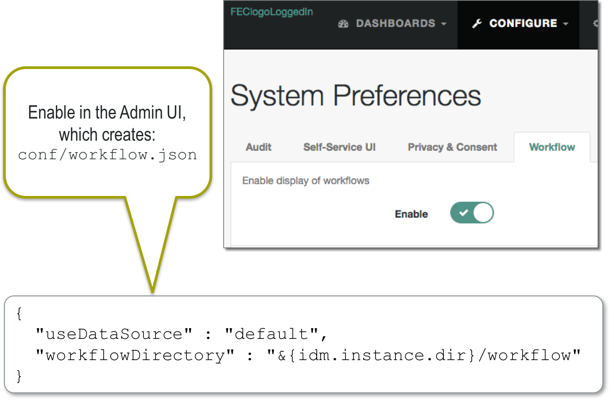

Note:

In the lab, you will use the Admin UI to enable the workflow service in IDM. You simply enable the option from the System Preferences page. This automatically creates the `conf/workflow.json` file in the project's configuration folder.

---

#### Sample OSGi workflow process

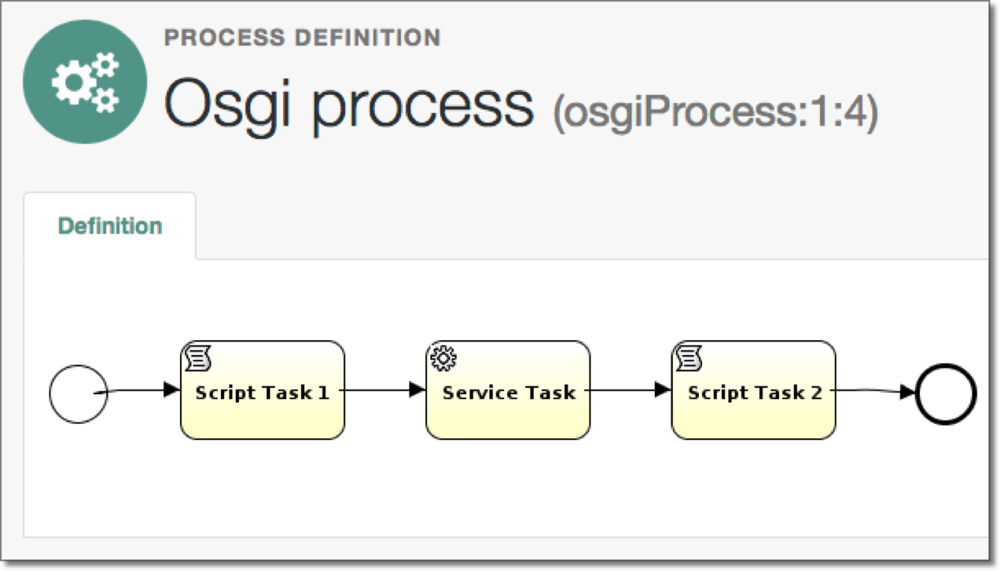

Copy sample to the project's workflow folder:  `example.bpmn20.xml`

Note:

IDM includes a couple of workflow samples. The simplest one is called the OSGi workflow process. It can be used to quickly test workflow in IDM to ensure workflow is enabled. The workflow is also easy to deploy; you simply copy the workflow from the sample folder to the project's `workflow` folder.

---

#### Lab exercises

- Perform the following exercise tasks in the Student Workbook:

  1. Enable the workflow service in IDM and examine a sample workflow.

- Approximate time: 30 minutes.

Note:

The slide lists the exercises to perform in this lesson. Please see the corresponding lab in the Student Workbook.

---

#### Deploying and Starting a Workflow

End of Lesson
