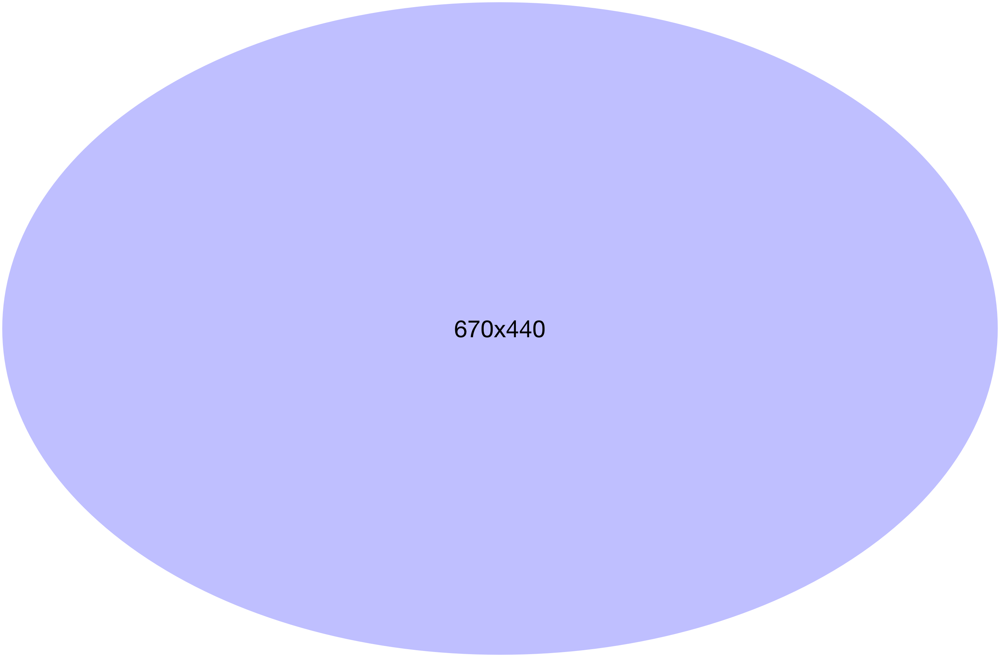
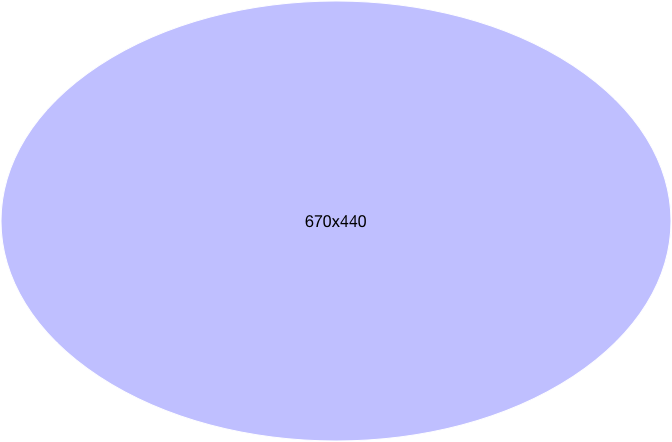
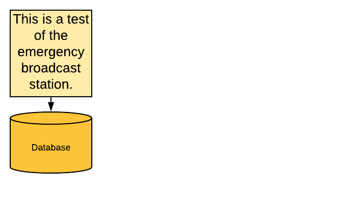

# Chapter 1: Basic Provisioning

---

## Performing Basic User Provisioning

> The main goal of this lesson is to introduce IDM and describe how you can quickly perform basic user provisioning between an external resource and IDM using the samples that ship with IDM.

Notes:
The lesson introduces basic concepts around IDM user provisioning and how you can easily download, install, and run IDM to demonstrate basic user provisioning. In this lesson, you learn IDM concepts such as installing and running IDM, logging in to the administrative and end user interfaces, and provisioning accounts from an external resource into the IDM repository using connectors, mappings, and managed user objects.

---

#### Lesson objectives

Upon completion of this lesson, you should be able to:

- Install and start IDM for the first time
- Start IDM with the XML sample configuration and run the sample
- Start IDM with the LDAP sample configuration and run the sample

---

### Install and start IDM for the first time

This first section describes how to install and start IDM for the first time.

---

#### TITLE TITLE TITLE TITLE TITLE TITLE TITLE TITLE TITLE TITLE TITLE



---

#### 2 TITLE TITLE TITLE TITLE TITLE TITLE TITLE TITLE TITLE TITLE TITLE



---

#### Try a LucidChart PNG 1



---

#### Try a LucidChart PNG 2


---

#### Download, unzip, and start IDM


Notes:

Installing IDM simply involves downloading the software zip file and unzipping the file to an empty folder.

For example, you can download and unzip either the released version of IDM or the evaluation build of IDM depending on your needs. For example, whether you are an existing customer with an appropriate license and account, or an evaluator who is interested in evaluating one or more ForgeRock products.

The student workstation in the instructor assigned lab environment already has the IDM evaluation zip file downloaded. In the first lab, you unzip the downloaded file to the `/opt/projects/` folder and test the samples in this `openidm` instance. In subsequent labs, you install IDM into other folders to keep your work separated. For example, in the next lab you install IDM in the `/opt/projects/enterprise` folder. This allows you to reference earlier work you have done.

The contents of the zip file are extracted to the `openidm` directory. To start IDM, simply change to the `openidm` directory and run the startup script.

IDM runs within an [OSGi Container](http://www.osgi.org/Technology/WhyOSGi). The current release of IDM is supported on the [Apache Felix](http://felix.apache.org/site/index.html) OSGi Container and is included with the installation of IDM.

Output messages are displayed on the Felix console, which is part of the Apache release. The console is useful for displaying errors that might occur during the configuration and operation of IDM. Note that messages are also logged to the IDM server log file.

Finally, the container runs within a Java Virtual Machine (JVM), which can run on most Operating Systems that support Java.

Note that the platform must be a supported Operating System and already have Java installed for running a Java Virtual Machine (JVM).

---

#### Download, unzip, and start IDM (TEST 2)


Notes:

Installing IDM simply involves downloading the software zip file and unzipping the file to an empty folder.

For example, you can download and unzip either the released version of IDM or the evaluation build of IDM depending on your needs. For example, whether you are an existing customer with an appropriate license and account, or an evaluator who is interested in evaluating one or more ForgeRock products.

The student workstation in the instructor assigned lab environment already has the IDM evaluation zip file downloaded. In the first lab, you unzip the downloaded file to the `/opt/projects/` folder and test the samples in this `openidm` instance. In subsequent labs, you install IDM into other folders to keep your work separated. For example, in the next lab you install IDM in the `/opt/projects/enterprise` folder. This allows you to reference earlier work you have done.

The contents of the zip file are extracted to the `openidm` directory. To start IDM, simply change to the `openidm` directory and run the startup script.

IDM runs within an [OSGi Container](http://www.osgi.org/Technology/WhyOSGi). The current release of IDM is supported on the [Apache Felix](http://felix.apache.org/site/index.html) OSGi Container and is included with the installation of IDM.

Output messages are displayed on the Felix console, which is part of the Apache release. The console is useful for displaying errors that might occur during the configuration and operation of IDM. Note that messages are also logged to the IDM server log file.

Finally, the container runs within a Java Virtual Machine (JVM), which can run on most Operating Systems that support Java.

Note that the platform must be a supported Operating System and already have Java installed for running a Java Virtual Machine (JVM).

---

#### Download, unzip, and start IDM (TEST 3)


Notes:

Installing IDM simply involves downloading the software zip file and unzipping the file to an empty folder.

For example, you can download and unzip either the released version of IDM or the evaluation build of IDM depending on your needs. For example, whether you are an existing customer with an appropriate license and account, or an evaluator who is interested in evaluating one or more ForgeRock products.

The student workstation in the instructor assigned lab environment already has the IDM evaluation zip file downloaded. In the first lab, you unzip the downloaded file to the `/opt/projects/` folder and test the samples in this `openidm` instance. In subsequent labs, you install IDM into other folders to keep your work separated. For example, in the next lab you install IDM in the `/opt/projects/enterprise` folder. This allows you to reference earlier work you have done.

The contents of the zip file are extracted to the `openidm` directory. To start IDM, simply change to the `openidm` directory and run the startup script.

IDM runs within an [OSGi Container](http://www.osgi.org/Technology/WhyOSGi). The current release of IDM is supported on the [Apache Felix](http://felix.apache.org/site/index.html) OSGi Container and is included with the installation of IDM.

Output messages are displayed on the Felix console, which is part of the Apache release. The console is useful for displaying errors that might occur during the configuration and operation of IDM. Note that messages are also logged to the IDM server log file.

Finally, the container runs within a Java Virtual Machine (JVM), which can run on most Operating Systems that support Java.

Note that the platform must be a supported Operating System and already have Java installed for running a Java Virtual Machine (JVM).

---

#### Review the IDM root directory structure

```javascript
./openidm
audit/          <--audit logs
bin/
bundle/
cli.bat
cli.sh
conf/           <--JSON configuration files
connectors/
db/
felix-cache/
legal-notices/
lib/
logs/           <--server logs
samples/        <--sample configurations
script/         <--custom script files
```

----

###### Continued

```shell
security/
shutdown.sh
startup.bat
startup.sh      <--startup script from the command line
ui/
workflow/       <--custom workflows
```

Notes:

The slide shows the folders below the `openidm` folder where IDM is installed. The subfolders highlighted represent the folders that administrators interact with on a regular basis.

---

#### View the Felix console at startup

```shell
$ ./startup.sh
Executing ./startup.sh...
Using OPENIDM_HOME:   /opt/projects/openidm
Using PROJECT_HOME:   /opt/projects/openidm
Using OPENIDM_OPTS:   -Xmx1024m -Xms1024m
Using LOGGING_CONFIG: -Djava.util.logging.config.file=/opt/projects/openidm/conf/logging.properties
Using boot properties at /opt/projects/openidm/conf/boot/boot.properties
-> OpenIDM ready
OpenIDM version "5.0.0" (revision: e6689a6) jenkins-OpenIDM – Release (5.x)-14 release/5.0.0

->
```

Notes:

The slide shows an example of starting IDM with one of the sample configurations:

The `-p` option specifies the *project* location that contains the necessary configuration and scripts to start and run IDM. This includes the `conf/` and `script/` folders. Other folders within the project location support the configuration files. For example, the `data/` folder contains the files necessary for the connector configuration files found in the `conf/` folder.

The output shows the project starting start messages. You should get an `-> OpenIDM ready` response if IDM boots correctly. The terminal window remains at the Felix console prompt `->` until the IDM instance is `shutdown` from the Felix console.

---

#### Log in to IDM


Notes:

After installation, the default user who is authorized to administer IDM is the `openidm-admin` user. The default password for the user is the same as the username.

IDM includes two user interfaces:

- Self-Service UI for regular users
- Admin UI for administrators

Notes:

The slide illustrates that the login page for both the Self-Service UI and Admin UI look identical; however, the URL's to access the interfaces are different. The Self-Service UI is for all authorized users accessing IDM. The Admin UI is specific for IDM administrators.

Note that the example shows the URL using the host and domain name of the server. You can also use `localhost` when working on the same server; however, it is best to try and use the proper name that you will be using when testing.

---

#### Log in to the Admin UI as the administrator user and view the Reconciliation Dashboard


Notes:

The slide shows a screenshot of what the IDM administrator would see when they first log in to the Admin UI.

The `openidm-admin` user has administrative privileges which let the administrator manage IDM (via the DASHBOARDS and CONFIGURE menu items) and manage the IDM users (via the MANAGE menu item).

Note that there are initially no end users managed by IDM. The administrator can choose to add users manually through the Admin UI (by selecting MANAGE and then USER). However, users are normally populated into the IDM repository by synchronizing with external resources that contain identity data or by allowing users to register through the Self-Service UI.

The Reconciliation Dashboard is automatically displayed when you first log in to the Admin UI as the administrator. The Dashboard page contains four main sections that allow you to quickly manage and view the state of the IDM installation. The administrator can also manage the Dashboard via the DASHBOARDS menu option and the + Add Widgets button.

The first section contains a Quick Start set of options that allow the administrator to perform the most common options when configuring or administering IDM.

---

#### View the Last Reconciliation and System Health sections in the Admin UI Dashboard


Notes:

If you scroll down from the Reconciliation Dashboard, the next two default sections of the Dashboard include information about the last reconciliation to occur, which in this case is empty because there are no connectors and mappings defined to synchronize identity data, and the system health.

Reconciliation is basically the *process* that initiates identity synchronization between an external resource and IDM. You first define a connector and how it communicates with an external resource and then define a synchronization mapping or rules between the connector and IDM to tell IDM how and when to synchronize data.

The System Health section contains a set of widgets to give you a visual indication of how much CPU and memory are used by IDM.

---

#### View the Resources section in the Admin UI Dashboard


Notes:

The Resources section of the Dashboard shows the administrator the list of Connectors, Mappings, and Managed Objects configured within IDM. These are the three main configurations needed when setting up user provisioning between external resources and IDM:

- Connectors are how IDM communicates to the external resources where identity data exists.
- Mappings are how IDM defines what, how, where, and when to provision identity data from the external resources.
- Managed Objects are the identity objects managed in IDM. For example, the user managed object is for managing user-related identities. Managed Objects are stored in the local IDM repository.

Note that three Managed Objects (user, role, and assignment) ship standard with IDM. This first lab focuses on provisioning users and the user managed object. Note that you are not restricted to managing only user objects. You can manage other objects such as devices and things by adding new managed objects.

---

#### View the configuration options in the Admin UI


Notes:

The IDM administrator can manage the Dashboard and can also manage the configuration of IDM through the CONFIGURE menu option.

Note that the Dashboard configuration options are not covered in this course. Please read the *ForgeRock Identity Management Integrator's Guide* for more information on how you can configure the Dashboard.

There are several configuration options that will be covered throughout this course; however, the two main configuration options that are key to basic user provisioning are the CONNECTORS and MAPPINGS option. As mentioned in previous slides, the administrator must first configure the connectors that connect to the external resources that contain identity data that you want to manage in IDM and the synchronization mappings between the connector and IDM that define how and when to synchronize data.

In this first lesson, you will run two of the samples included with IDM that already have the connectors and mappings pre-configured. These samples allow you to quickly test IDM without having to perform the actual configuration. The following lessons describe how to actually configure the connectors and mappings in detail.

---

#### Manage users from the User list as the administrator


Notes:

The administrator can also manage the different objects that are defined in IDM from the MANAGE menu option. For example, the administrator can manage users from the User list page. From this page you can view, add, delete, and edit users that are stored in the IDM repository.

Notice that when you first install IDM, there are no end users defined in the IDM repository. Please note that the administrator user, `openidm-admin`, is considered an internal user and not a regular end user, therefore, does not show up in the User list.

---

#### Self-Service UI Dashboard for end users


Notes:

The IDM administrator or any user added to the IDM repository can log in to the Self-Service UI as long as a password is set on the account, the correct authorization is set on the account, and the account is active. The user also has a Dashboard page that shows tasks, processes, and notifications for the user. The user can also view their profile and update their password, if necessary.

Note that tasks, processes, and notifications are related to workflow and will be described in the Workflow Engine chapter.

---

#### View the Felix console at shut down


Notes:

The administrator can shut down the IDM instance from the Felix console where the instance was started. Note that IDM can also be started outside the Felix console as a process in Linux or a service in Windows. There is a `shutdown.sh` or `shutdown.bat` script in the main project folder that you can use to shut down IDM.

---

### Start IDM with a sample configuration and run the sample

This section describes how you can start IDM using the samples shipped with IDM.

---

#### Basic User Provisioning using the XML sample


Notes:

In the first lab you perform basic user provisioning using the XML and LDAP sample configurations shipped with IDM. The slide shows the basic configuration for the XML sample.

Basically you have an external resource, XML in this example, that contains identity data that you want to provision into the IDM repository so that you can manage the identity from IDM. For example, you might want to provision that identity from IDM to other external resources besides the XML resource.

Basic provisioning involves three basic steps:

1. Adding a connector configuration between IDM and the external resource that defines how IDM communicates to the external resource.
2. Adding a sync mapping from the source to the target that defines what identity objects and attributes to provision (reconcile) from the source to the target.
3. Running reconciliation and synchronization to initiate provisioning.

The IDM sample configuration includes a connector configuration that tells IDM how to communicate with the XML external resource. The sample configuration also includes a *synchronization mapping* or *sync mapping* that defines the synchronization parameters between the source XML file and the target managed user in the IDM repository.

The XML sample external resource contains two user entries for the `bjensen` and `scarter` users. When a reconcile action is run, either from the Admin UI or using the REST interface of IDM, the two users are provisioned into the IDM repository using the connector and sync mapping configuration.

#### Review the IDM sample configuration folders


The `openidm` folder contains everything needed to run inside of a JVM on the local operating system.

The slide shows the `samples` folders that you will work with for this class.

As described in the previous lesson, the `samples` folder contains all of the shipping sample configurations included with IDM. In the lab, you will use both `sample1` and `sample2b` to test basic user provisioning.

#### Review the IDM sample 1 configuration folder


The slide shows the subfolders and files relevant to the sample 1 configuration.

The `conf/` and `script/` folders contain the IDM configuration that will be used at startup instead of those same named folders found directly under the `openidm` folder.

The `data/` folder contains the XML schema files needed as part of the XML connector configuration and the XML file that contains the sample data (for example, `bjensen` and `scarter`).

#### View the Felix console at startup


The slide shows an example of starting IDM with one of the sample configurations.

The `-p` option specifies the *project* location that contains the necessary configuration and scripts to start and run IDM. This includes the `conf/` and `script/` folders. Other folders within the project location support the configuration files. For example, the `data/` folder contains the files necessary for the connector configuration files found in the `conf/` folder.

The output shows the project starting start messages. You should get an `-> OpenIDM ready` response if IDM boots correctly. The terminal window remains at the Felix console prompt `->` until the IDM instance is shut down from the console.

#### The Admin UI Dashboard Resources section


The Dashboard Resources section contains a list of connectors, mappings, and managed objects all key to provisioning identities in IDM.

Connectors are the communication paths to the external resources that contain identity data. You must add a connector configuration for each external resource where you want to retrieve or provision identity data. The slide shows what the Resources section would look like after loading the XML sample.

For each connector, you will have one or more mappings that define the identity object type (user in this example) and attributes (or properties) of that object type that you want to synchronize between the external resource and IDM. The slide shows a single mapping from the source XML external resource (`systemXmlfileAccounts`) to the target IDM repository (`managedUser`). The object type is an *account* in this example, which are user accounts on the XML resource which map to user objects in the repository.

The third resource shown in the slide example are Managed Objects. Managed Objects are the types of identity objects that IDM can manage. The object type is user in both the XML and LDAP samples that you will be testing in the lab. However, you can add different types of objects that you want to manage in IDM.

---

#### Run reconciliation to provision users


Notes:

Because the sample(s) already contains the necessary connector and sync mapping configurations, you simply need to run reconciliation on the mapping to provision the sample users.

The slide shows the XML sample mapping from the object type (account) on the XML resource to the managed user object in the IDM repository. Selecting Reconcile Now will provision the two sample users from the XML resource to the IDM repository based on the sync mapping configuration, which you will examine more thoroughly in the lab and later in the lesson.

#### View the managed users in the Admin UI


You can view the provisioned users from the User List. In the Admin UI, select Manage and then User from the main menu to go to the User List page. The User List page displays all users that are in the repository, including those provisioned from the XML external resource.

In the slide example, the User List displays the two users, `bjensen` and `scarter` that are provisioned from the XML external resource.

#### View a specific user and Linked Systems tab


As administrator in the Admin UI, you can view details and other information about a specific user. The slide shows an example of the Linked Systems tab for the `bjensen` user. The Linked Systems tab shows you the properties and values retrieved from the XML connector configuration for the sample XML file.

Note that other tabs are described in different portions of the course.

---

### Start IDM with the LDAP sample configuration and run the sample

This section describes running the LDAP sample.

---

#### Basic User Provisioning using the LDAP sample


The LDAP sample, shipped with IDM, uses an external LDAP directory server for an external resource instead of XML, therefore, the lab setup requires not only IDM, but access to an LDAP directory server. In the lab you will install and use ForgeRock Directory Service (DS) as the LDAP directory server and load the directory with sample data provided with the sample shipped with IDM.

The sample contains a connector configuration to communicate with the LDAP directory server and two sync mappings that allow provisioning in both directions between IDM and the LDAP directory server. Users can be provisioned from LDAP into IDM and users added to IDM can be provisioned into LDAP.

Note that any user that is added or created in the IDM repository is automatically synchronized to any external resource where a sync mapping between the source IDM repository and the target external resource exists.

#### Review the IDM sample 2b configuration folder


The slide shows the subfolders and files relevant to the sample 2b configuration. You will use `sample2b` to test with an external LDAP directory running OpenDJ.

The `conf/` and `script/` folders contain the IDM configuration that will be used at startup instead of those same named folders found directly under the `openidm` folder.

The `conf/` folder contains two specific configurations that are unique to `sample2b`:

- `provisioniner.openicf-ldap.json` contains the connector configuration specific for communicating with the external LDAP resource.
- `sync.json` contains the synchronization mappings between the connector and IDM. This file defines how identities are mapped from one resource to another.

The `data/` folder for `sample2b` contains an LDIF file that you must import into the external LDAP resource before you run the sample. The LDIF file contains the sample data referenced by the sample in the documentation.

To use the sample, use the `-p` option with the relative path to the `sample2b` folder where the configuration and scripts are to start the sample.

#### View the Resources section of the Dashboard


The Resource section of the Admin UI Dashboard for the administrator user now displays the configuration picked up with the `-p samples/sample2b` option of the `startup` command. The configuration includes a connector configuration to communicate to the LDAP directory server and two mappings that define which object types and object properties to map from the source to the target. The source and target in this example, is both ways between the LDAP directory server and the IDM repository. The object type in this example is `account` on the LDAP directory server and managed user in the IDM repository (although not clearly shown on the slide example).

#### Verify the connector in the Admin UI


The Admin UI has a convenient way to view the connector status and validate that the connector can communicate with the external resource. From the Connectors page, there is a vertical ellipsis where you can select the data object type supported by the connector to view actual data returned by the connector from the external resource.

The small screenshot on the slide is where you first select the vertical ellipsis and object type. Notice on the small screenshot that the status of the connector is Active. This is a good indication that the connector can successfully communicate with the external resource. The second larger screenshot shows the accounts returned from the connector in the UI.

Note that this method of viewing actual connector data in the UI does not always work for every type of connector.

---

#### Mappings for the LDAP sample


Notes:

The Mappings page of the Admin UI shows the mappings between the source and targets. In this example, there are two mappings between the accounts object type on the external resource and the managed user in the IDM repository.

You need to run reconciliation on the external resource to IDM mapping to provision users to the IDM repository; however, users added to the repository, for example, through the Admin UI, are automatically provisioned to the external resource because of implicit sync.

Note that the administrator can force a reconciliation from the managed user to external resource at any time.

---

#### Lab exercises

Perform the following exercises in the Student Workbook:

1. Install and start IDM for the first time.
2. Start IDM with the XML sample configuration.
3. Start IDM with the LDAP sample configuration.

   Approximate time for the lab is 45 minutes.

   All exercises are done in the `/opt/projects` folder.

Notes:

It is highly recommended that you take a break from the lecture and perform the lab exercises, especially if you have never installed or ran IDM in the past.

Note that all of the exercises for this lab are done in the `/opt/projects` folder. This folder will be used to test all IDM samples throughout the course. In other labs, you install IDM (and sometimes DS) into a new folder to separate your work. Installing IDM (and sometimes DS) into other folders lets you keep your work separate so you can always reference work done in the testing samples folder and not mix your work with your *development* test environment.

---

#### Performing Basic User Provisioning

The end of the lesson.
