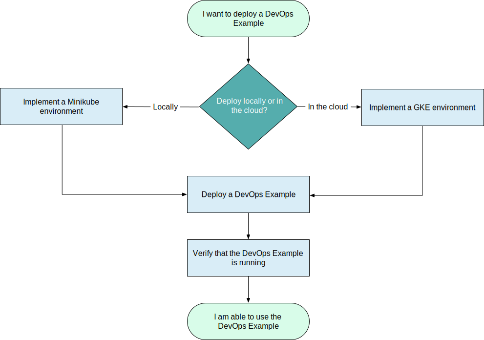
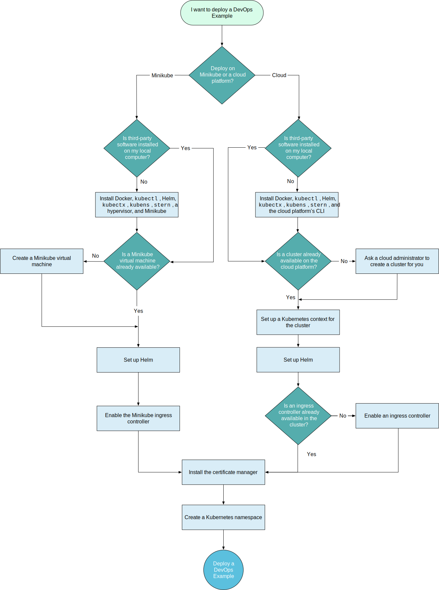
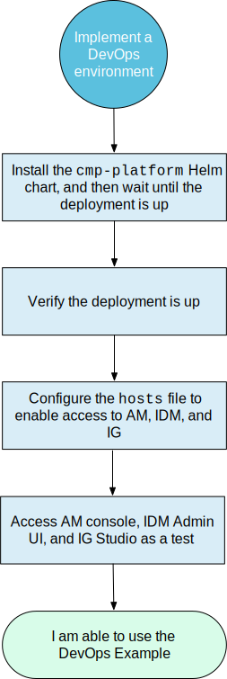
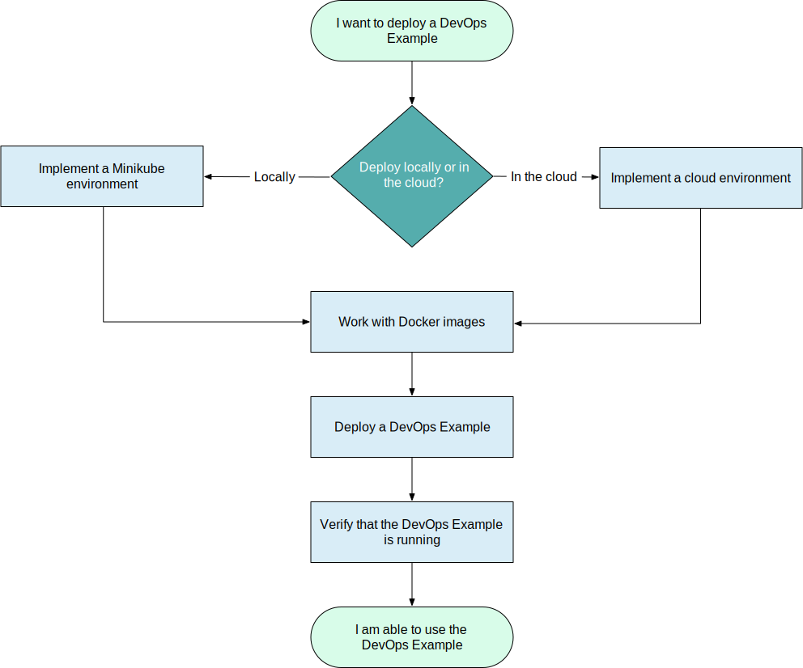
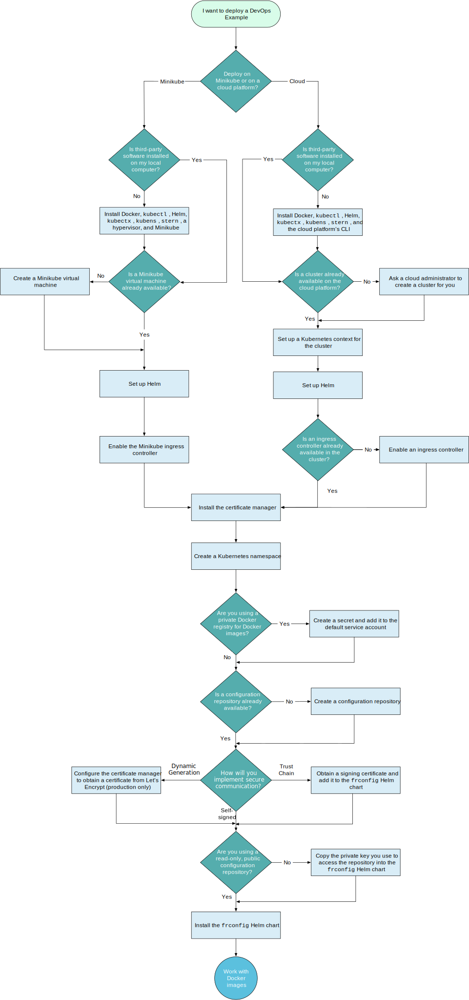

# FR-523: Deploying the ForgeRock Identity Platform™ using DevOps  

---

Note:  

This is the working title of the course based on the initial Front-End Analysis (FEA).  

This document is the Instructional Design Document and presentation slides combined into one document.  

The hope is to be able to both document and synchronize the design and presentation at the same time.  

Changes will be logged in our ForgeRock University Stash (Git) repository:  

<https://stash.forgerock.org/projects/UN/repos/fr-523/browse>  

The _Notes:_  line separates the slide from the speaker notes.  

Experimenting with using RevealJS for slides.  

## Preface  

---

Note:  

This is the _Preface_ section which introduces the course goal and objectives and sets the stage for the course.  

In Markdown, this is the ## level which denotes a “chapter” in our course structure; however, this is not really a chapter in the true sense.  

The next level down in this outline represents the slides for the Preface.  

The third heading level ### represents the slide title, while the iThoughtsX notes section contains the slide content and speaker notes.  

I am thinking that the third level ### also represents the “Lesson” level in a “Chapter”.  
In that case, it is really a transition slide.  

As a refresher, here is the hierarchical structure of our courses from the CBF:  

Course title (CG) > Chapter title (IG) > Lesson title (LO) > Enabling Objective title (EO, EO-K, EO-S)  

### Course goal  

> Deploy ForgeRock software in a containerized environment  

---

Note:  

This is the expected _Final Student Performance_ or Goal for the entire course.  

At the end of the course, what do we expect students to be able to do.  

The Goal should be written as an objective.  

Typically a short sentence/paragraph.  

I am using a Markdown quote to present the summary sentence/paragraph.  

### Use case(s)  

> What is the major use case for this course and what should students be able to do by the end of the course?  

---

Note:  

This is the major use case for the course.  

Each instructional level (CG, IG, LO, EO) needs to have both a Goal and Use case description.  

### Concepts to learn  

What are the desired concepts we need to ensure are taught in this course?  

---

Note:  

This is really not a slide in the presentation, but a placeholder during the _Analysis and Design_ phases to capture this information and then place it somewhere in the objectives of the course.  

### Skills to aquire  

What are the desired skills we need to ensure are taught in this course?  

---

Note:  

This is really not a slide in the presentation, but a placeholder during the _Analysis and Design_ phases to capture this information and then place it somewhere in the objectives of the course.  

### Target audience(s)  

Target audience(s) for this course include:  

* Partners responsible for deploying ForgeRock products using DevOps techniques  

---

Note:  

It is absolutely essential that the target audience or audiences for this course be properly identified.  

### Prerequisites  

The following prerequisites are necessary to successfully complete this course:  

* Docker  
* Kubernetes  
* Helm  
* Google GKE  
* GitHub account access (for storing configurations)  
* Generic knowledge of Microsoft Azure, Amazon Web Services (AWS), Public Key Infrastructure (PKI), DNS, Load balancers, Oracle VirtualBox, and access to the ForgeRock protected Maven repository (for building custom docker images)  

---

Note:  

This heading item contains sub-headings that go into more detail.  

These sub-headings will likely move to the speaker notes; however, RevealJS has the option to nest slides vertically.  

The instructor may or not present nested slides.  

#### Docker  

<https://docs.docker.com/get-started/>  

##### Describe the concepts around Docker and containerization and the terminology used within the Docker community  

###### Just Docker  

###### Docker engine vs client  

* What is the difference between Docker Engine and Docker Client?  

    - The docker engine runs the images as containers  
    - The docker client is the utility to manage and run the images  

###### Docker and Kubernetes relationship  

What is the difference or relationship between Docker and Kubernetes:  

- Docker is the container technology solution  
- Kubernetes manages docker containers  

Kubernetes is a container orchestration solution.  
Docker Swarm is an alternative to Kubernetes as a container orchestration solution, which is why it is necessary to understand the relationship between Docker and Kubernetes. Do not confuse Docker and Docker Storm as the same thing.  

More information can be found on DZone: <https://dzone.com/articles/true-facts-about-kubernetes-vs-docker-itsyndicate>  

###### Docker image vs container  

Link: [docs.docker.com/get-started/][1]  

* A docker image is basically a snapshot of a container  
* An image becomes a container when run  

##### Prepare and install Docker for development and production environments  

##### Use the Docker commands for building and managing containerized applications  

###### Build a containerized application  

* Docker documentation has samples  
* [github.com/docker/labs/blob/master/developer-tools/nodejs/porting/1_node_application.md][2]  

###### Run a containerized application image in docker  

###### List the status of an image vs a running containerized application  

###### Run a containerized application in the background  

###### Stop a running containerized application  

#### Kubernetes  

##### Describe the concepts around containerization and Kubernetes and how to work with Kubernetes Clusters  

##### Install `kubectl`  

##### Use the `kubectl` command for operating within a cluster and deploying containerized applications  

###### [kubernetes.io/docs/tutorials/kubernetes-basics/create-cluster/cluster-intro/][3]  

###### …  

#### Minikube  

##### Describe the concepts for using Minikube with Kubernetes and the bootstrapping options for working with a cluster  

##### Install Minikube  

##### Use the Minikube CLI commands to start and manage a cluster  

#### Helm  

#### Google Cloud Platform  

##### [cloud.google.com/kubernetes-engine/][4]  

#### Microsoft Azure  

##### [azure.microsoft.com/en-us/services/kubernetes-service/][5]  

#### Amazon Web Services  

##### [aws.amazon.com/eks/][6]  

#### public key infrastructure (PKI)  

#### DNS  

#### load balancers  

#### Oracle VirtualBox  

#### GitHub account is needed to fork `forgeops-init`  

[ea.forgerock.com/docs/platform/devops-guide/index.html#devops-repos][7]  

#### Access the ForgeRock protected Maven repositories  

##### [backstage.forgerock.com/knowledge/kb/article/a74096897][8]  

### Tools  

* GitHub  
* Stash (Git) repository for project:  
    <https://stash.forgerock.org/projects/UN/repos/fr-523>  

---

Note:  

During the design, identify any tools that are necessary to use.  

This might not be an actual slide.  

### References  

The following references are available:  

* DevOps Quick Start Guide  
* DevOps Developer’s Guide  
* Site Reliability Guide  
* Cloud Deployment Model Cookbook  
* DevOps Release Notes  

### Environmental conditions  

Environmental considerations for this course include:  

* CloudShare VM in the role of the host (desktop) environment  
* Google GKE for cloud deployment  

---

Note:  

As part of the analysis and design, try to identify what the lab environment needs to look like.  

Typically, the lab environment mimics a “developers” environment and not production.  

Some notes on the CloudShare environment based on the initial analysis:   

CloudShare VM:  

* Linux  
    * Using Ubuntu - check Helm support: docs.helm.sh/using_helm/#ubuntu-with-kubeadm  
* 2 CPU  
* 8 GB memory  
* 40 GB disk space  
* Software already installed on platform:  
    * Docker client  
    * Kubernetes client  
    * Kubernetes Helm  
    * Kubernetes context switching utilities  
    * Kubernetes log display utility  

### Agenda  

| Day | Chapter | Lesson | Time Estimate |  
|:----:|:----------|:---------|:----------------:|  
|  1    | chapter title | lesson title | Morning |  
|  1    | chapter title | lesson title | Afternoon |  
|  2    | chapter title | lesson title | Morning |  

---

Note:  

This should probably be a table that outlines the daily agenda for this course.  

What is the expected duration of the course?  

## Chapter 1: Installing the ForgeRock DevOps Examples  

---

Note:  

This first chapter is an introduction to the ForgeRock DevOps Examples available on GitHub and how to quickly deploy the examples using a given lab environment that has all the third-party software necessary for running a Kubernetes cluster with Minikube.  

### Goal  

> Use the DevOps Quick Start Guide to quickly install the ForgeRock DevOps examples available on GitHub  

### Use case  

* For students new to deploying the ForgeRock products using DevOps techniques  
* Use the provided ForgeRock DevOps Quick Start Guide  
* To quickly install all of the ForgeRock products in a Minikube or GKE cloud environment  
* Using the evaluation product software that has already been containerized  
* And using the default configurations posted on GitHub  
* To learn the basic mechanics of deploying the ForgeRock products using DevOps  

### Lesson 1: Overview of Installing the ForgeRock DevOps Examples  

#### Goal  

> Walk through the ForgeRock DevOps documentation to learn about the overall deployment using the ForgeRock DevOps Examples  

#### Use case  

> Introduce students to the ForgeRock DevOps documentation set that they can use to learn how to deploy using DevOps techniques.  

#### Access the ForgeRock DevOps documentation website  

#### Access the Start Here page  

#### Installing third-party software  

##### Follow the instructions in <https://ea.forgerock.com/docs/platform/release-notes/index.html#rnotes-before-env-sw>  

#### Overview of the DevOps Quick Start Guide  

> Quick introduction to ForgeRock Identity Platform™ deployment using DevOps techniques for new users and readers evaluating the software.  

#### Overview of the Quick Start deployment process  

  

#### Implementing a DevOps Environment  

  

### Lesson 2: Using the DevOps Quick Start Guide to Deploy the ForgeRock DevOps Examples  

#### Goal  

> Walk through the instructions of the DevOps Quick Start Guide to demonstrate a deployment of the entire ForgeRock Identity Platform using one Helm chart and then let students perform the same steps on their assigned CloudShare VM.  

#### Use case  

Students use their assigned CloudShare VM to run through the same steps as presented so they can demonstrate a deployment.  

#### State of the CloudShare VM  

The CloudShare VM is acting in the role of a local desktop development environment running Minikube:  

* Ubuntu 18.04.1 server installed  
* Running a minimal desktop distribution  
* Docker CE 18.06.1-ce is installed  
* `kubectl` client is installed  
* VirtualBox is installed (hypervisor for Kubernetes)  

#### Access your assigned CloudShare VM  

#### Making your VM Console in CloudShare Visible  

* Depends on monitor size  
* Readjust settings to view the VM console window  
* VM console window is necessary because you need to run a browser in the local environment to access the container endpoints  

#### Create a Minikube VM  

Make sure you have enough disk space on the host system:  

`$` **`df -h`**  

Create the minikube instance:  

`$` **`minikube start --memory=8192 --disk-size=20g --vm-driver=virtualbox --bootstrapper kubeadm`**   

Note:  

Launch Virtual Box to verify the minikube VM has been created.  

#### Verify third-party software is installed  

* Docker  
* Kubectl  
* VirtualBox  
* etc  

#### Fixing Firefox to Override Security  

Helpful to delete `.mozilla` folder if you are unable to see the Advanced button to override the security certificate  

#### Deploy the ForgeRock Identity Platform  

  

#### Test access to each of the ForgeRock products  

#### Use the remove pods script to remove and clean up the cluster  

### Lesson 3: Deploying the ForgeRock DevOps Examples to GKE  

#### Goal  

#### Use case  

#### Repeat deployment, but this time to GKE  

## Chapter 2: Implementing a DevOps Environment  

### Goal  

Use the ForgeRock DevOps Developer’s Guide to implement a local and cloud-based DevOps environment for deploying one or more ForgeRock docker images in a Kubernetes cluster.  

### Use case  

### Lesson 1: Overview of Implementing a DevOps Environment  

#### Goal  

Use the DevOps Developers Guide to setup a local and cloud-based environment for deploying individual ForgeRock products.  

#### Use case  

#### From Chapter 1 of the DevOps Guide  

##### ForgeRock DevOps practices  

Containerization:  

* ForgeRock DevOps Examples support [Docker](https://www.docker.com) containerization  


Orchestration:  

* ForgeRock DevOps Examples run on the [Kubernetes](https://kubernetes.io) orchestration framework  

##### Supported Kubernetes implementations  

* Google Kubernetes Engine (GKE)  
* Minikube  

###### Kubernetes built-in features  

* Automated best-effort container placement  
* Monitoring  
* Elastic scaling  
* Storage orchestration  
* Self-healing  
* Service discovery  
* Load balancing  
* Secret management  
* Configuration management  

##### Overview of the deployment process  

  

#### From Chapter 2 of the DevOps Guide  

##### Overview of implementing a DevOps environment  

  

##### Setting up a Minikube environment  

See table from the DevOps Developers Guide:  

<https://ea.forgerock.com/docs/platform/devops-guide/index.html#devops-implementation-env-table-minikube>  

Note:  

The CloudShare VM has all the third-party software already installed. Students will perform the remaining tasks in the table.  

##### Setting up a GKE cloud environment  

[ea.forgerock.com/docs/platform/devops-guide/index.html#devops-implementation-env-table-cloud][9]  

##### Overview of the local environment  

[ea.forgerock.com/docs/platform/devops-guide/index.html#devops-implementation-env-table-cloud][10]  

##### Overview of the cloud-based environment  

[ea.forgerock.com/docs/platform/devops-guide/index.html#devops-implementation-env-table-cloud][11]  

#### Create a configuration repository  

[ea.forgerock.com/docs/platform/devops-guide/index.html#devops-repos][12]  

##### Log in to GitHub  

##### Fork the `ForgeRock/forgeops-init` repository to your local GitHub account  

##### Open a terminal window on the CloudShare VM and clone your fork of the `forgeops-init` repository  

##### Configure a remote for the fork  

`$` **`git remote -v`**  

```  
origin    https://github.com/bgallantgit3/forgeops-init.git (fetch)  
origin    https://github.com/bgallantgit3/forgeops-init.git (push)  
```  

`$` **`git remote add upstream https://github.com/ForgeRock/forgeops-init.git`**  

`$` **`git remote -v`**  

```  
origin    https://github.com/bgallantgit3/forgeops-init.git (fetch)  
origin    https://github.com/bgallantgit3/forgeops-init.git (push)  
upstream    https://github.com/ForgeRock/forgeops-init.git (fetch)  
upstream    https://github.com/ForgeRock/forgeops-init.git (push)  
```  


[ea.forgerock.com/docs/platform/devops-guide/index.html#devops-repos][13]  

### Lesson 2: Implementing a Local DevOps Environment  

#### Goal  

Use the DevOps Developers Guide to deploy one or more ForgeRock products to a local DevOps environment running on Minikube.  

#### Use case  

### Lesson 3: Implementing a Cloud-Based DevOps Environment  

#### Goal  

Use the DevOps Developers Guide to deploy one or more ForgeRock products to a cloud-based DevOps environment running on GKE.  

#### Use case  

## Chapter 3: Deploying the ForgeRock Identity Platform  

### Goal  

Use chapter 4, 5, and 6 of the ForgeRock DevOps Developers Guide to deploy each of the ForgeRock Examples:  

* AM and DS  
* IDM  
* IG  

And then _perhaps_ deploy a custom configuration using your GitHub configuration repository.  

### Use case  

Now that students have setup either a local development environment or cloud-based environment, they should now be able to deploy each of the ForgeRock Examples from the given DevOps Developer’s Guide. After they have successfully deployed each example, they should be able to customize the configuration and deploy again.  

### Lesson 1: Deploying the AM and DS Example  

### Lesson 2: Deploying the IDM Example  

### Lesson 3: Deploying the IG Example  

## Chapter 4: Building and Pushing Docker Images for the ForgeRock Identity Management Platform  

### Goal  

Build and push docker images for the ForgeRock Identity Platform based on the `forgeops` Git repository to your own repository.  

### Use case  

### Customize the ForgeRock Helm charts in the `forgerops` Git repository  

## Chapter 5: Replicating the ForgeRock Deployment Model on Google Kubernetes Environment  

### Goal  

#### How much, if any, should be covered from the _Cloud Deployment Model Cookbook for GKE_ in this course?  

#### What hands-on are possible?  

## Notes of possible topics and tasks to be organized into chapters and lessons  

### Providing secure access over HTTPS to ForgeRock Identity Platform servers  

### Troubleshooting Common Kubernetes Problems  

#### [kukulinski.com/10-most-common-reasons-kubernetes-deployments-fail-part-1/][14]  


[1]: https://docs.docker.com/get-started/  
[2]: https://github.com/docker/labs/blob/master/developer-tools/nodejs/porting/1_node_application.md  
[3]: https://kubernetes.io/docs/tutorials/kubernetes-basics/create-cluster/cluster-intro/  
[4]: https://cloud.google.com/kubernetes-engine/  
[5]: https://azure.microsoft.com/en-us/services/kubernetes-service/  
[6]: https://aws.amazon.com/eks/  
[7]: https://ea.forgerock.com/docs/platform/devops-guide/index.html#devops-repos  
[8]: https://backstage.forgerock.com/knowledge/kb/article/a74096897  
[9]: https://ea.forgerock.com/docs/platform/devops-guide/index.html#devops-implementation-env-table-cloud  
[10]: https://ea.forgerock.com/docs/platform/devops-guide/index.html#devops-implementation-env-table-cloud  
[11]: https://ea.forgerock.com/docs/platform/devops-guide/index.html#devops-implementation-env-table-cloud  
[12]: https://ea.forgerock.com/docs/platform/devops-guide/index.html#devops-repos  
[13]: https://ea.forgerock.com/docs/platform/devops-guide/index.html#devops-repos  
[14]: https://kukulinski.com/10-most-common-reasons-kubernetes-deployments-fail-part-1/  
